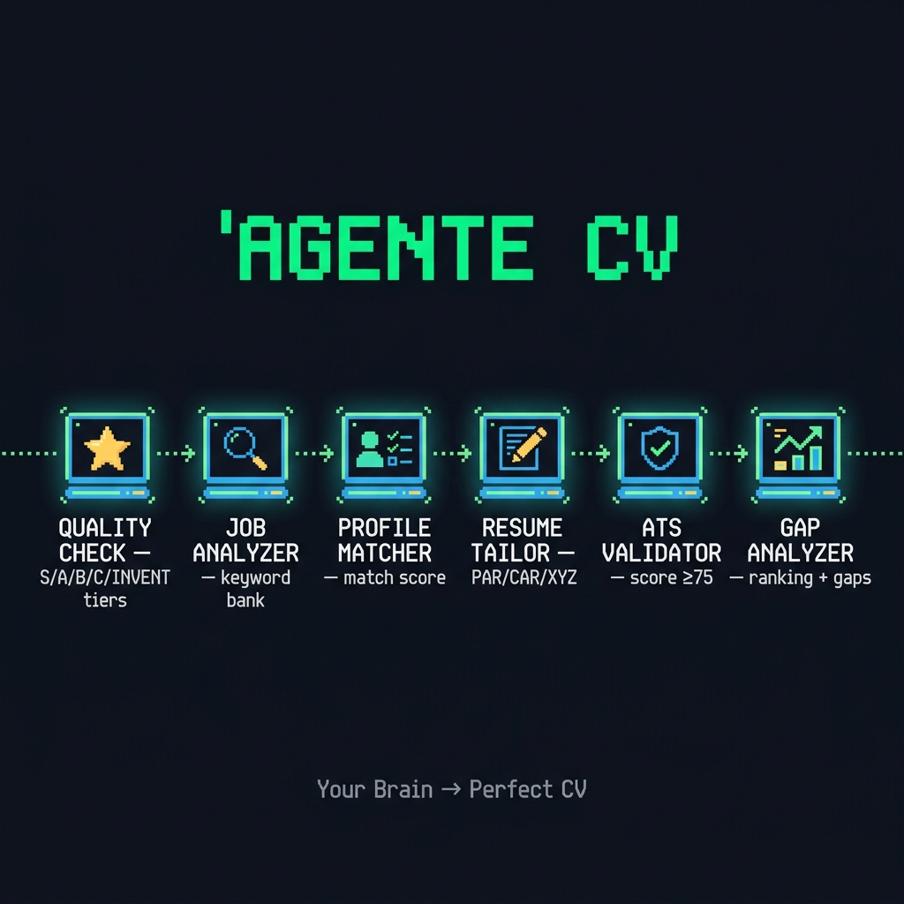

# 🧠 Agente CV

> **An agentic system that turns your professional life into a job-winning CV — automatically.**
>
> Feed it a job description. It reads your experience, maps your skills, writes tailored bullets,
> validates ATS compliance, and tells you exactly what's missing. No fluff. No guesswork.

<div align="center">



**[📖 How It Works](#how-it-works) · [🚀 Quickstart](#quickstart) · [🛠️ Skills](#the-6-skills) · [🔄 Workflows](#workflows)**

</div>

---

## Why This Exists

Most people write their CV once and blast it everywhere. ATS systems reject 75% of applications before a human ever sees them — not because the candidate is bad, but because the document doesn't speak the machine's language.

**Agente CV fixes this.** It treats your CV as a dynamic artifact: rewritten from scratch for each application, using a persistent "Brain" of your real experiences, metrics, and stories. Every output is ATS-optimized, human-convincing, and grounded only in what you've actually done.

---

## How It Works

### Your Brain (One-time setup)
Four plain Markdown files store everything the system needs to know about you:

```
context/candidate/
├── profile.md        → Who you are, your target roles, your preferences
├── experiences.md    → Every job, with metrics and achievements
├── skills.md         → Hard skills, soft skills, certs, education
└── life_stories.md   → STAR-format impact stories for CVs and interviews
```

### The Pipeline (`/apply`)
Give it a job description (URL or text). The system runs 6 skills in sequence:

```
Job Offer
   │
   ▼
[①  QUALITY CHECK]   → Evaluates your Brain depth → assigns tier S/A/B/C/INVENT
   │
   ▼
[②  JOB ANALYZER]    → Extracts requirements, builds keyword bank, detects binary filters
   │
   ▼
[③  PROFILE MATCHER] → Cross-references your Brain → match score + recommended CV angle
   │
   ▼
[④  RESUME TAILOR]   → Writes tailored CV using PAR/CAR/XYZ bullet formulas
   │
   ▼
[⑤  ATS VALIDATOR]   → Scores keyword coverage, structure, and anti-hallucination
   │
   ├── Score ≥ 75 → ✅ Final CV output
   └── Score < 75 → 🔄 Back to Tailor (automatic iteration)
```

Plus the optional **GAP Analyzer**: rank multiple job offers by fit, and get specific actions to close each gap.

---

## The 6 Skills

| Skill | What It Does |
|---|---|
| 🏆 `candidate-quality` | Scores your Brain (0-100) and assigns a quality tier that governs the entire pipeline |
| 🔍 `job-analyzer` | Parses any job description into structured requirements + keyword bank with regional variants |
| 🎯 `profile-matcher` | Maps your experiences to the job's requirements, scores the match, suggests a CV angle |
| ✍️ `resume-tailor` | Drafts ATS-optimized bullets using PAR/CAR/XYZ formulas with strict anti-hallucination guardrails |
| 🛡️ `ats-validator` | Validates keyword coverage, structure (no tables/columns), and produces a pass/fail score (≥75 = green) |
| 📊 `gap-analyzer` | Ranks multiple job offers by fit, calculates gap points per offer, generates actionable closing recommendations |

Plus the onboarding skill:

| Skill | What It Does |
|---|---|
| 🎤 `candidate-interview` | 53-question structured interview in 4 pillars (Past / Present / Future / Personal) to build your Brain from scratch |

---

## Quality Tier System

Before generating anything, the system scores your Brain (0–100) and assigns a tier that determines what it can reliably produce:

| Tier | Score | Meaning |
|---|---|---|
| 🏆 **S** | 85–100 | Full power — maximum personalization, all formulas active |
| ✅ **A** | 70–84 | Standard — competitive output, proxy metrics where needed |
| ⚠️ **B** | 50–69 | Proceed with warnings — functional but not differentiating |
| 🔶 **C** | 25–49 | Restricted — draft output, enrichment required |
| 🔴 **INVENT** | 0–24 | Example mode only — generates fictional CV clearly labeled as such |

---

## Workflows

| Workflow | When to Use |
|---|---|
| `/onboarding` | **First time**: populate your Brain from scratch using the structured interview or an existing CV |
| `/apply` | **Every application**: end-to-end pipeline from job description to validated CV |

---

## Quickstart

```bash
# 1. Clone the repo
git clone https://github.com/italianooggi/friendly-meeting.git agente-cv
cd agente-cv

# 2. Fill in your Brain
# Edit the 4 template files in context/candidate/
# (or run /onboarding for a guided interview)

# 3. Apply to a job
# Paste a job URL or description and run /apply
# The agent handles the rest
```

This system is designed to run **conversationally** inside any AI coding assistant that supports agent skills (e.g., Antigravity, Cursor, Windsurf). No API keys required. No server. No deployment.

---

## Design Principles

- **KISS**: Every component is a plain Markdown file. No frameworks, no databases, no config hell.
- **Anti-hallucination**: Every CV bullet must trace back to a source file. The system cannot invent.
- **ATS-first**: Single column, standard headings, no tables, no icons, no headers/footers in the CV body.
- **Multi-candidate ready**: One Brain folder per person. Contexts never mix.
- **Obsidian-compatible**: All files are standard Markdown — open them anywhere.

---

## Repository Structure

```
agente-cv/
├── .agents/workflows/
│   ├── onboarding.md         # Guided candidate setup
│   └── apply.md              # End-to-end CV generation pipeline
│
├── context/
│   ├── ats_rules.md          # ATS formatting rules by market (US, EU, LATAM)
│   └── candidate/
│       ├── profile.md        # ← Fill this first
│       ├── experiences.md    # ← Your work history with metrics
│       ├── skills.md         # ← Technical + soft skills
│       └── life_stories.md   # ← STAR impact narratives
│
├── skills/
│   ├── candidate-quality/    # Quality scoring + tier assignment
│   ├── candidate-interview/  # 53-question onboarding interview
│   ├── job-analyzer/         # Job description parser
│   ├── profile-matcher/      # Candidate ↔ Job cross-reference
│   ├── resume-tailor/        # CV writer (PAR/CAR/XYZ)
│   ├── ats-validator/        # ATS compliance scorer
│   └── gap-analyzer/         # Multi-offer ranking + gap closing
│
├── output/                   # Generated CVs and reports (git-ignored)
├── templates/                # Formatting templates (future)
└── assets/
    └── pipeline.png          # Visual pipeline diagram
```

---

## What Gets Generated

After running `/apply`, the `output/` directory contains:

- `quality_report.md` — your Brain's score and tier
- `job_analysis.md` — structured extraction of the job requirements
- `match_report.md` — your fit score + recommended CV angle
- `cv_draft.md` — the final tailored CV
- `validation_report.md` — ATS score and keyword coverage
- `gap_analysis.md` — ranking + gap report (if using GAP Analyzer)

All output files are git-ignored by default. Archive any application with `/apply → Step 8`.

---

## License

MIT — use it, fork it, build on it.

---

<div align="center">

*Built with [Antigravity](https://github.com/italianooggi) · Powered by agentic skills · Anti-hallucination by design*

</div>
